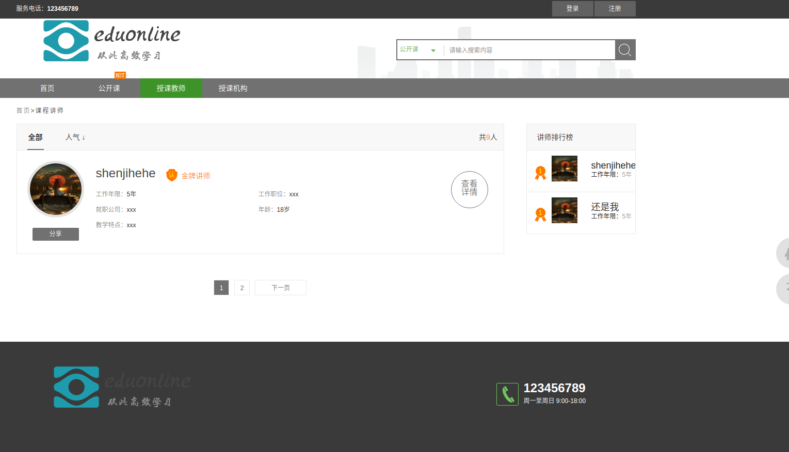

# 介绍
### 此项目为仿慕课和51cto站点
### 基于python3重新架构（填坑无数，不排除有未发现的坑，若有请联系本人）
### django+xadmin+mysql打造
### 依赖环境详见requirements.txt，请使用替换文件中文件替换
### mysql数据库备份文件为eduonline.sql
### 后台登录页面为 url/xadmin
### 自行修改settings.py 中数据库账号与密码，及验证邮箱的账号密码和SMTP地址

#### 实现功能：
实现慕课，51cto（此类在线教育网站的基本功能）
1.用户基本注册，邮箱验证，密码安全等一系列功能
2.机构，教师展示，收藏，评论等功能并实现细节分类搜索
3.课程咨询课程上下架、修改、收藏，评论等功能并实现细节分类搜索
4.更多功能等待你去发现

###细节展示
首页

课程

教师界面

机构界面

后台管理界面

城市管理

用户信息管理

具体页面不一一展示，请自行尝试

### 更新
1.修复部分小bug
2.更改后台页面风格（折叠菜单
![8.png](./8.png）
          